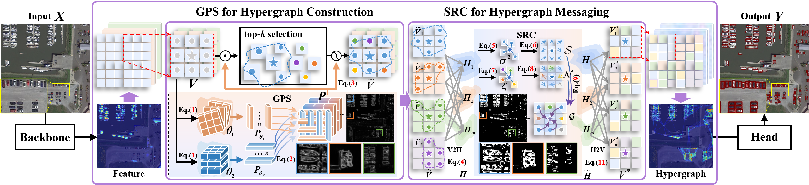

# GSRH: Geometric-Semantic Regulated Hypergraph for Tiny Object Detection

Official implementation of **Geometric-Semantic Regulated Hypergraph (GSRH)** for tiny object detection in remote sensing imagery.

GSRH introduces a geometry-semantic regulated hypergraph framework to model polyadic higher-order correlations among tiny objects, addressing dense layouts, low signal-to-noise ratio, contextual clutter, and feature ambiguity.

## Overview

Tiny object detection in remote sensing is challenging because tiny instances are easily overwhelmed by background regions and pairwise relations are insufficient in dense scenes. As shown in the pipeline figure below, GSRH addresses this issue by inserting a geometry-semantic regulated hypergraph module between the backbone and detection head.



GSRH contains two task-aware components:

- **GPS (Geometric Prior Synthesis)**: generates geometry-aware vertices and hyperedges through axis-aligned prior modulation and Top-K selection.
- **SRC (Semantic Reliability Controller)**: estimates hyperedge reliability and regulates high-order message passing.

The overall pipeline is:

```text
Backbone Feature → GPS → Geometry-aware Hypergraph Construction → SRC → Regulated High-order Representation → Detection Head
```

## Key Components

### 1. GPS: Geometric Prior Synthesis

GPS generates an axis-aligned geometric prior from horizontal and vertical directional responses. The prior modulates vertex features and guides Top-K vertex selection, reducing background-dominated candidates during hypergraph construction.

Main functions:

* axis-aligned directional aggregation;
* geometry-aware feature modulation;
* Top-K vertex selection;
* improved hyperedge purity under cluttered tiny-object scenes.
* 
### 2. SRC: Semantic Reliability Controller

SRC estimates hyperedge reliability from self-region and neighbor-context statistics. It softly gates hyperedge-to-vertex propagation to suppress unreliable background-dominated message passing while preserving useful sparse-object cues.

Main functions:

* vertex-to-hyperedge aggregation;
* self-region reliability estimation;
* neighbor-context reliability estimation;
* reliability-gated hyperedge-to-vertex propagation.

## Environment

Recommended environment:

```text
Python >= 3.8
PyTorch >= 2.0
CUDA-compatible GPU
Linux / Windows
```

Create environment:

```bash
conda create -n gsrh python=3.10 -y
conda activate gsrh
```

Install PyTorch, for example with CUDA 12.1:

```bash
pip install torch torchvision torchaudio --index-url https://download.pytorch.org/whl/cu121
```

Install dependencies:

```bash
pip install ultralytics opencv-python pyyaml scipy tqdm matplotlib psutil pillow thop
```

## Data Preparation

The paper evaluates GSRH on:

- [VEDAI](https://downloads.greyc.fr/vedai/)
- [USOD](https://github.com/yemu1138178251/FFCA-YOLO)
- [AI-TOD](https://github.com/jwwangchn/AI-TOD)

## Training

Example training command:

```bash
yolo task=detect mode=train \
  model=/path/to/gsrh.yaml \
  data=/path/to/data.yaml \
  epochs=300 \
  imgsz=800 \
  batch=16 \
  device=0 \
  workers=8
```
## Evaluation

```bash
yolo task=detect mode=val \
  model=runs/detect/train/weights/best.pt \
  data=/path/to/data.yaml \
  imgsz=800 \
  batch=32 \
  device=0
```

## Inference

Images or folders:

```bash
yolo task=detect mode=predict \
  model=runs/detect/train/weights/best.pt \
  source=/path/to/images \
  imgsz=800 \
  conf=0.25 \
  device=0
```

## Experimental Settings

For fair comparison, the main experiments use:

```text
Input size: 800 × 800
Epochs: 300
Batch size: 16 for training
Batch size: 32 for validation/testing
Optimizer: SGD
Momentum: 0.937
Weight decay: 0.0005
Initial learning rate: 0.01
Final learning rate: 0.0001
Workers: 8
AMP: enabled
Multi-scale training: disabled
```

## Citation

If this project is helpful to your research, please cite:

```bibtex
@article{zheng2026gsrh,
  title={Geometric-Semantic Regulated Hypergraph for Tiny Object Detection},
  author={Zheng, JinJie and Zhuang, Jingyi and Sa, Baihui and Xiang, Wenjie and Zhang, Zetao and Zhu, Jianqing},
  journal={arXiv preprint arXiv:2110.13389},
  year={2026}
}
```

## Acknowledgements

This project is built upon the Ultralytics codebase. We thank the Ultralytics team and the remote sensing tiny-object detection community for their open-source contributions.

